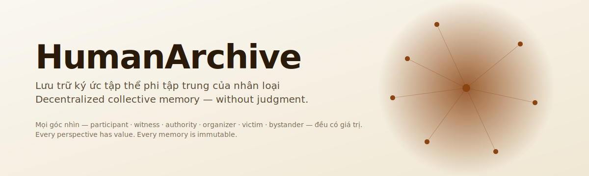

<div align="center">



# HumanArchive

**Lưu trữ ký ức tập thể phi tập trung của nhân loại — không phán xét.**

[](https://github.com/Trustydev212/HumanArchive/actions/workflows/ci.yml)
[](tests/)
[](LICENSE)
[](LICENSE-CONTENT)
[](pyproject.toml)
[](https://www.anthropic.com)
[](docs/AGENT.md)

Tiếng Việt · [English](README_EN.md)

</div>

> **Lịch sử được viết bởi người chiến thắng.** Cho đến bây giờ.
>
> HumanArchive là một giao thức + reference implementation để lưu trữ
> **ký ức đa góc nhìn** về các sự kiện lịch sử — nơi một nhân chứng,
> một nạn nhân, một người có thẩm quyền, và một người ngoài cuộc đều
> có thể cùng kể về một sự kiện, và **cả AI lẫn curator đều không
> được phép phán xét ai "đúng"**.

## Tại sao dự án này tồn tại

Mọi narrative lịch sử đều có hình dạng được áp đặt bởi **người có quyền
xuất bản**: người chiến thắng, người biết chữ, người có giọng nói to
nhất. Những người còn lại — nạn nhân không dám lên tiếng vì sợ trả đũa,
nhân chứng ở rìa sự kiện, người tham gia nhưng vai trò quá nhỏ để vào
tiểu sử — hầu như không để lại dấu vết.

HumanArchive lật ngược điều đó. Bất cứ ai từng sống qua sự kiện đều có
thể đóng góp một ký ức **nặc danh**. AI cross-reference nhiều ký ức để
tìm điểm trùng và điểm khác — **không kết luận ai đúng**. Dữ liệu thô
bất biến; consent được enforce bằng code.

## Thử trong 60 giây

```bash
git clone https://github.com/Trustydev212/HumanArchive
cd HumanArchive
pip install -e .
humanarchive demo
humanarchive web        # mở http://localhost:8000/web/
```

Hết. Demo tự build RAG index, export Obsidian vault, sinh Mermaid graph
của quan hệ giữa các event, và chạy audit report — tất cả trên dữ liệu
**hư cấu demo** bạn có thể khám phá trước khi đóng góp ký ức thật.

```bash
humanarchive rag "tại sao xả đập sớm?"
# Trả về role-balanced top-5 citations + LLM synthesis
```

## 5 nguyên tắc bất biến

Đây không phải guideline. Chúng được enforce bởi **code với test chứng
minh**:

| Nguyên tắc | Enforce bằng |
|---|---|
| **1. Không phán xét đúng/sai** | `FORBIDDEN_FIELDS` trong LLM client refuse output có `verdict`, `guilty`, `is_lying` (`test_ethics.py`) |
| **2. Không xác định danh tính** | PII scrubber chạy **trước** mọi call LLM; `contributor_id` không thể đoán; query scrub trước embed |
| **3. Đồng cảm trước phân tích** | Trauma detection + content warning; LLM system prompt buộc acknowledge trước |
| **4. Động cơ > hành động** | Schema required `motivation.your_motivation`; AI engine raise `ValueError` nếu thiếu |
| **5. Dữ liệu thô không đổi** | `memory_id = sha256(content)[:16]`; CI verify; `withdrawn` / `embargo` filter không xoá |

Xem [`docs/ethics.md`](docs/ethics.md).

## RAG đặc thù cho dữ liệu nhạy cảm

RAG cổ điển trên ký ức có 4 failure mode phá huỷ toàn bộ mục đích của
archive đa góc nhìn. Ta chặn từng cái:

| Rủi ro | Phòng vệ |
|---|---|
| PII leak qua embedding | Scrub **trước** embed, không phải sau retrieve |
| Consent drift | `is_publicly_viewable` + `allows_ai_analysis` gate ở index time |
| Bias amplification (10 witness át 1 victim) | **Role-balanced retrieval** — top-1 mỗi role |
| Identity-probe attack | Query scrub trước embed |

Xem [`docs/rag.md`](docs/rag.md).

## Kiến trúc

```
Tầng đóng góp        tools/submit.py, web/submit.html
       │
       ▼
Schema + validation  core/schema/memory.json (v1)
       │
       ▼
Tầng archive         archive/events/<id>/<memory_id>.json  (bất biến)
       │
       ├─► core/privacy/pii_scrubber.py   (regex + LLM tuỳ chọn)
       ├─► core/integrity.py              (memory_id + consent filter)
       ├─► core/trauma.py                 (content warnings)
       └─► core/annotations.py            (context append-only)
       │
       ▼
Tầng phân tích       core/ai_engine.py, core/rag/
                     (Claude + adaptive thinking + prompt caching)
       │
       ▼
Views                core/graph.py → Mermaid / Obsidian / JSON
                     Web UI /web/ (RAG search client-side)

Federation           tools/export_bundle.py, tools/import_bundle.py
                     (merkle root + ed25519 signature)
```

## Bắt đầu theo vai trò

### 🎙️ **Contributor** (người giữ ký ức)
Mở `web/submit.html` trong trình duyệt — không cần đăng ký. Bạn chọn:
vai trò (participant/witness/authority/organizer/victim/bystander),
chuyện gì xảy ra, động cơ của bạn, bạn sợ gì khi đó, bạn hiểu gì sau
này. Tuỳ chọn: embargo đến ngày tương lai, hoặc withdraw sau.

### ✍️ **Curator** (reviewer, không sửa)
```bash
humanarchive staging list                                       # inbox
humanarchive staging review <mid> --type approve --reviewer <handle>
humanarchive staging merge <mid>                                # khi đủ 2+ approvals
```
Bạn **không bao giờ sửa** memory. Gợi ý qua annotation; contributor tự quyết.

### 📚 **Researcher** (nhà nghiên cứu)
```bash
humanarchive rag "tại sao xả đập sớm?"
```
Luôn citation `memory_id + role + archive@<git-tag>`.

### 🌍 **Node operator** (vận hành mirror)
```bash
humanarchive export-bundle --output mirror.tar.gz --sign-key priv.pem
humanarchive import-bundle received.tar.gz --archive my_archive/
```
Content-addressed dedup tự nhiên; tamper được phát hiện qua merkle.

Xem [`CONTRIBUTING.md`](CONTRIBUTING.md) cho đủ 5 personas.

## So sánh

|  | Đa góc nhìn | Bất biến | Nặc danh | Federate | AI cross-ref |
|---|---|---|---|---|---|
| Wikipedia | ❌ (NPOV consensus) | partial | partial | ❌ | ❌ |
| Archive.org | random | ✅ | n/a | ❌ | ❌ |
| Obsidian | ❌ (personal) | ❌ | ❌ | ❌ | ❌ |
| Mastodon | partial | ❌ (edits) | partial | ✅ | ❌ |
| **HumanArchive** | **✅ structured** | **✅** | **✅ default** | **✅ bundles** | **✅ with safeguards** |

Chi tiết: [`docs/COMPARISON.md`](docs/COMPARISON.md). Thắc mắc skeptical: [`docs/FAQ.md`](docs/FAQ.md).

## Stack

- **Python 3.10+** — core modules, zero required runtime deps
- **Claude Opus 4.6** (Anthropic) cho analysis, adaptive thinking + prompt caching
- **Voyage AI** (đa ngôn ngữ) hoặc **sentence-transformers** local cho RAG
- **Mermaid** cho relation graph
- **Obsidian** vault là view chính (wikilinks + YAML frontmatter)
- **ed25519** (via `cryptography`) để ký federation bundle
- **Git + tar.gz** cho federation (không blockchain)
- **Vanilla JS + HTML** cho web UI (không build step)

## Tài liệu

- [`docs/ethics.md`](docs/ethics.md) — 5 nguyên tắc chi tiết
- [`docs/workflows.md`](docs/workflows.md) — multi-user patterns (**đọc bắt buộc**)
- [`docs/rag.md`](docs/rag.md) — RAG safeguards
- [`docs/federation.md`](docs/federation.md) — bundle protocol v1
- [`docs/event_decomposition.md`](docs/event_decomposition.md) — vì sao folder phẳng + cách dựng phân cấp
- [`docs/FAQ.md`](docs/FAQ.md) — trả lời thẳng thắn các câu hỏi skeptical
- [`docs/COMPARISON.md`](docs/COMPARISON.md) — vs Wikipedia, Obsidian, Mastodon, ...

## Đóng góp

[`CONTRIBUTING.md`](CONTRIBUTING.md) có **5 đường đóng góp không cần
code** (keeper, curator, researcher, translator, node operator) — mỗi
cái quan trọng ngang code.

Code of Conduct: [`CODE_OF_CONDUCT.md`](CODE_OF_CONDUCT.md). Bắt nguồn
trực tiếp từ 5 nguyên tắc — không generic.

Security: [`SECURITY.md`](SECURITY.md). PII leak có kênh riêng; ethical
vulnerabilities được patch ngay lập tức.

## Citation

```bibtex
@software{humanarchive2024,
  title = {HumanArchive: Decentralized Collective Memory Archive},
  author = {{HumanArchive contributors}},
  year = {2024--},
  url = {https://github.com/Trustydev212/HumanArchive},
  license = {MIT (code), CC-BY-SA 4.0 (content)}
}
```

## Roadmap

- [x] v0.1–v0.4: schema, ethical guardrails, RAG, Obsidian export
- [x] v0.5: federation bundle protocol, Web UI
- [x] v0.6: staging + annotation + audit workflows
- [x] v0.7: installable package, community scaffolding, bilingual docs
- [ ] v0.8: i18n Web UI (EN/FR/ZH), timeline view, IPFS auto-pin
- [ ] v0.9: mobile PWA submission, WebAuthn reviewer signing
- [ ] v1.0: production-grade federation, first external instance

## License

- **Code**: [MIT](LICENSE)
- **Memory content**: [CC-BY-SA 4.0](LICENSE-CONTENT) với điều khoản
  đạo đức bổ sung (không deanonymize, không train model phán xét,
  không harass).

---

<div align="center">

> *"Lịch sử không phải là một dòng chảy duy nhất. Nó là một chòm sao
> của vô số góc nhìn — và chỉ khi ta đọc nó từ nhiều phía, sự thật
> mới khó bị che giấu."*

**Nếu bạn đủ dũng cảm để giữ một ký ức, chúng tôi đủ cẩn trọng để bảo vệ nó.**

[Tìm hiểu →](docs/ethics.md) · [Thử ngay →](#thử-trong-60-giây) · [Đóng góp →](CONTRIBUTING.md)

</div>
