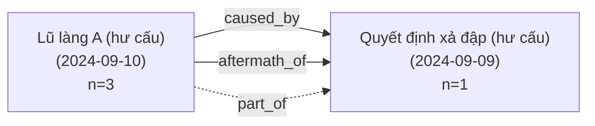

```mermaid
graph LR
  E_2024_example_dam_release_demo["Quyết định xả đập (hư cấu)<br/>(2024-09-09)<br/>n=1"]
  E_2024_example_village_flood_demo["Lũ làng A (hư cấu)<br/>(2024-09-10)<br/>n=3"]
  E_2024_example_village_flood_demo -->|caused_by| E_2024_example_dam_release_demo
  E_2024_example_village_flood_demo -->|aftermath_of| E_2024_example_dam_release_demo
  E_2024_example_village_flood_demo -.->|part_of| E_2024_example_dam_release_demo
```
