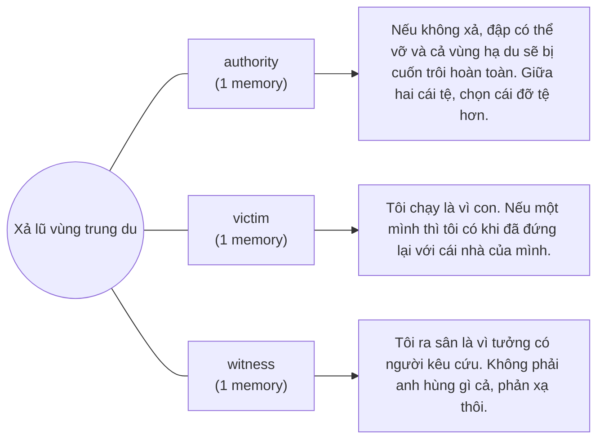

# Perspective prism — Xả lũ vùng trung du

*event_id: `2024-example-village-flood-demo`*

```mermaid
graph LR
  EVENT(("Xả lũ vùng trung du"))
  ROLE_authority["authority<br/>(1 memory)"]
  EVENT --- ROLE_authority
  M_0["Nếu không xả, đập có thể vỡ và cả vùng hạ du sẽ bị cuốn trôi hoàn toàn. Giữa hai cái tệ, chọn cái đỡ tệ hơn."]
  ROLE_authority --> M_0
  ROLE_victim["victim<br/>(1 memory)"]
  EVENT --- ROLE_victim
  M_1["Tôi chạy là vì con. Nếu một mình thì tôi có khi đã đứng lại với cái nhà của mình."]
  ROLE_victim --> M_1
  ROLE_witness["witness<br/>(1 memory)"]
  EVENT --- ROLE_witness
  M_2["Tôi ra sân là vì tưởng có người kêu cứu. Không phải anh hùng gì cả, phản xạ thôi."]
  ROLE_witness --> M_2
```

> **Các vai trò chưa có ký ức (cần được lắng nghe):** participant, organizer, bystander

