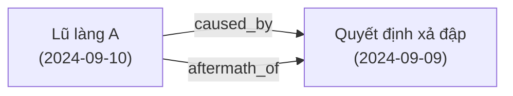
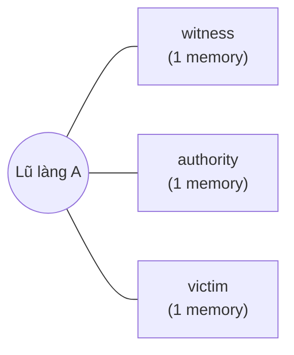

# Event decomposition — phân loại & dựng view từ archive phẳng

Tài liệu này giải thích **vì sao folder `archive/events/` không được
phân cấp theo loại sự kiện** (không có `events/war/`, `events/storm/`,
`events/covid/`), và **làm sao tạo các view phân cấp** từ archive phẳng.

## Tại sao folder phẳng?

Một sự kiện lịch sử thường thuộc **nhiều loại cùng lúc**:

- Chiến tranh Việt Nam → `conflict/war/civil-war`, `humanitarian/displacement`,
  `personal-collective/separation`, `economic/nationalization`.
- Đại dịch COVID-19 → `public-health/pandemic/covid-19`,
  `economic/financial-crisis`, `humanitarian/mass-migration`
  (hồi hương về quê), `personal-collective/loss-of-family`.
- Lũ miền Trung → `natural-disaster/flood`,
  `technological/infrastructure-failure` (nếu có liên quan thuỷ điện),
  `humanitarian/displacement`.

Nếu chọn **phân cấp folder**, ta phải chọn **một** taxonomy duy nhất —
và mọi taxonomy khác bị mất. Ví dụ, đặt ký ức lũ Miền Trung 2024 vào
`events/natural-disaster/` thì người nghiên cứu di dân sẽ không tìm
thấy; đặt vào `events/humanitarian/` thì người nghiên cứu thiên tai
không thấy.

**Ngoài ra**, phân cấp folder vi phạm nguyên tắc 5 một cách tinh vi:
nếu cộng đồng quyết định đổi taxonomy (ví dụ: gộp `storm` và `typhoon`
lại), mọi `event_id` trước đó sẽ bị đổi path. Git có thể theo dõi rename
nhưng mọi URL / reference cũ sẽ hỏng.

## Giải pháp: flat physical layout + rich metadata

```
archive/events/<event_id>/         ← phẳng, immutable, content-addressed
    <memory_id>.json
    _index.json
```

Mỗi memory khai báo:
- `event.tags`: mảng tag tự do, viết thường-gạch-nối.
- `event.categories`: mảng đường dẫn taxonomy từ `taxonomy/categories.json`.
  Một memory có thể có NHIỀU categories.
- `context.related_event_ids`: id các event liên quan (đơn giản).
- `context.relations`: quan hệ CÓ CẤU TRÚC — `{event_id, type, note?}`.
  Các `type` hợp lệ:

  | type | Ý nghĩa |
  |---|---|
  | `part_of` | Event này là phần của event lớn hơn |
  | `caused_by` | Event này do event kia gây ra |
  | `led_to` | Event này dẫn tới event kia |
  | `happened_during` | Event này xảy ra trong thời gian event kia |
  | `aftermath_of` | Event này là hệ quả sau của event kia |
  | `contradicts` | Lời kể ở hai event mâu thuẫn (KHÔNG phán xét đúng/sai — chỉ mô tả) |
  | `corroborates` | Lời kể ở hai event củng cố nhau |

## Từ archive phẳng → dựng view

`core/graph.py` + `tools/graph_export.py` dựng 4 loại view:

### 1. Category tree

```bash
python tools/graph_export.py tree > CATEGORY_TREE.md
```

Output Markdown bullet list cho phép xem archive dưới dạng cây:

```
- natural-disaster/
  - flood (1 event)
    - 2024-example-village-flood-demo — Lũ làng A (hư cấu)
- technological/
  - infrastructure-failure (2 event)
    - 2024-example-dam-release-demo — Quyết định xả đập (hư cấu)
    - 2024-example-village-flood-demo — Lũ làng A (hư cấu)
```

Một event xuất hiện ở **nhiều nhánh** vì nó có nhiều `categories`.

### 2. Relation graph (Mermaid)

```bash
python tools/graph_export.py mermaid > GRAPH.md
```

Output Mermaid diagram render trực tiếp trên GitHub:



### 3. Perspective prism

```bash
python tools/graph_export.py prism <event_id> > PRISM.md
```

Một event → nhánh theo role. Dùng để so sánh trực quan các góc nhìn:



### 4. JSON export (cho UI tùy chọn)

```bash
python tools/graph_export.py json > graph.json
```

Trả về `{nodes, edges, tag_counts, category_tree}` — plug vào:
- **D3.js** (`d3-force`, `d3-hierarchy`)
- **Cytoscape** / **Sigma.js** (web graph rendering)
- **Gephi** (desktop graph analysis — cần chuyển qua GEXF)
- **Obsidian** (có thể tạo note `[[backlink]]` từ edges)
- **Neo4j** (graph database cho truy vấn phức tạp)

## Taxonomy

`taxonomy/categories.json` — cây phân loại chuẩn của dự án. 8 root:

- `conflict` (war, civil-unrest, persecution)
- `natural-disaster` (storm, flood, earthquake, tsunami, wildfire, drought, landslide)
- `public-health` (pandemic → covid-19/hiv-aids/sars, epidemic-local, ...)
- `humanitarian` (displacement, refugee-crisis, famine, mass-migration)
- `economic` (financial-crisis, hyperinflation, land-reform, nationalization)
- `social-movement` (civil-rights, labor, environmental, womens-rights)
- `technological` (industrial-accident, infrastructure-failure, cyber-incident)
- `personal-collective` (birth-under-crisis, loss-of-family, separation)

**Mở rộng taxonomy**: PR vào `taxonomy/categories.json`. Không được
xóa category cũ (gây break mọi event đã gắn). Nhãn luôn trung lập —
tránh các từ phán xét ("thảm họa do X gây ra", "sai lầm lịch sử").

## Khi nào nên thêm tag vs thêm category?

| Dùng `tags` khi... | Dùng `categories` khi... |
|---|---|
| Cần nhóm nhanh, không chính thức ("miền-trung", "thập-niên-90") | Cần tuân theo taxonomy chuẩn của dự án |
| Từ khoá cụ thể của một vùng văn hoá | Loại sự kiện rộng, có giá trị so sánh liên văn hoá |
| Người đóng góp tự đề xuất | Được review theo taxonomy |

Cả hai đều optional — một event không tag/category nào sẽ xuất hiện ở
`_uncategorized` trong category tree, và không bị loại khỏi graph.
